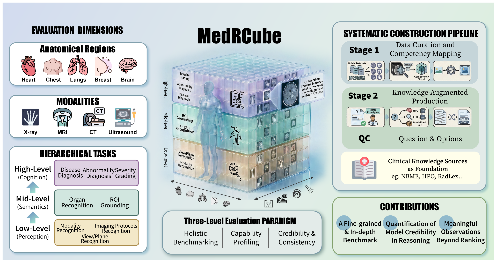
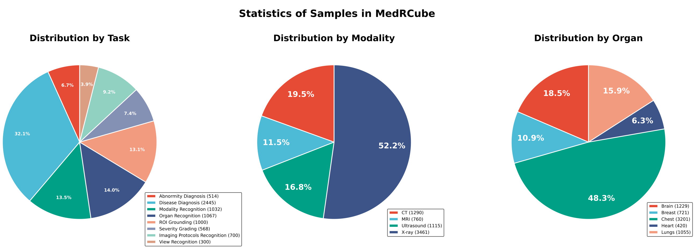
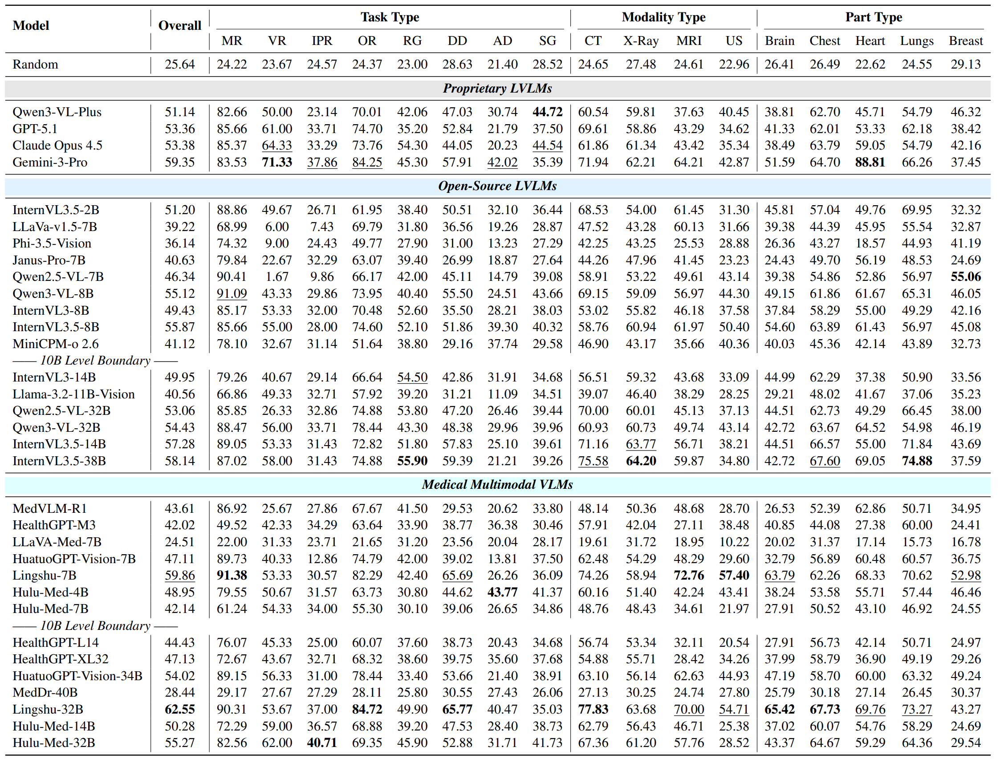

<h1 align="center">
  MedRCube: A Multidimensional Framework for Fine-Grained and In-Depth Evaluation of MLLMs in Medical Imaging
</h1>

<p align="center">
  <a href="https://arxiv.org/abs/2604.13756" target="_blank">📖 arXiv Paper</a> •
  <a href="https://huggingface.co/datasets/Flmc/MedRCube" target="_blank">🤗 HuggingFace Dataset</a> 
</p>

## 🔥 News
- **🔥 [2026-04-14]** MedRCube is published!

> **Release note:** About 1,000+ samples from restricted sources include questions and metadata only — images are not redistributed due to licensing constraints. Reproducible preprocessing scripts are **coming soon** so researchers can reconstruct images after obtaining access from the original providers.

## ✨ Highlights

- **7,626** rigorously constructed samples from **36** medical imaging datasets, spanning **5** anatomical regions, **4** imaging modalities, and **8** cognitive tasks.
- A **three-axis Competency Space** (Anatomy × Modality × Task) replaces flat metrics, enabling precise localization of model capabilities and deficits.
- **Reasoning credibility quantification** — multi-level task chains on the same image reveal whether a correct reasoning is grounded in valid perception or just a shortcut.
- **33 MLLMs** benchmarked; the best reaches only **62.55%** overall, with substantial variance across the competency space.
- **Failing the basics**: models that diagnose diseases still flunk view recognition (coronal vs. sagittal) — a day-one radiology skill.
- **Stronger ≠ more trustworthy**: diagnostic accuracy correlates positively with shortcut reliance (**r = 0.693, p < 10⁻⁵**) — much of the apparent progress may be clinically untrustworthy.

## 📖 Overview

**MedRCube** is a multidimensional medical imaging benchmark designed to answer not just *how well* a model performs, but *where*, *why*, and *how credibly* it does so.

<p align="center">
   
</p>

In total, MedRCube comprises **7,626** high-quality samples curated from **36** diverse datasets covering **5** anatomical regions (Heart, Chest, Breast, Lung, Brain), **4** imaging modalities (X-ray, CT, MRI, Ultrasound), and **8** cognitive tasks organized into a three-tier hierarchy. Unlike prior benchmarks that report a single aggregate score or organize evaluation along one dimension, MedRCube structures every sample into a **Competency Space** defined by three orthogonal axes:

| Axis | Coverage |
|---|---|
| **Anatomical Region** | Heart, Chest, Breast, Lung, Brain |
| **Imaging Modality** | X-ray, CT, MRI, Ultrasound |
| **Task Hierarchy** | *Low-level:* Modality / View / Protocol Recognition → *Mid-level:* Organ Recognition, ROI Grounding → *High-level:* Abnormality Diagnosis, Disease Diagnosis, Severity Grading |

Each (Anatomy × Modality × Task) intersection forms a **Competency Voxel** for fine-grained capability localization. Crucially, the task hierarchy mirrors the radiological reasoning process, so multi-level task chains on the *same* image can verify whether a correct high-level answer is genuinely grounded in low-level perception — or is merely "hallucinated correctness", a right diagnosis from a model that fails to recognize even the target organ.

This design supports a three-level evaluation paradigm: **holistic benchmarking** for overall ranking, **fine-grained capability profiling** by slicing along any axis or zooming into specific voxels, and **credibility verification** through cross-level consistency analysis on shared images.


## 🔧 Construction

MedRCube is built through a two-stage pipeline with **radiologist and clinical expert** involvement at every step:

- **Stage I — Competency Mapping.** Fragmented source datasets are re-interpreted under a unified taxonomy via metadata-driven task derivation, mapping each sample into the Competency Space and ensuring dense, balanced coverage across axes.
- **Stage II — Item Production.** Questions follow [NBME](https://www.nbme.org/) item-writing principles; distractors are generated using knowledge-augmented strategies (HPO ontology, RadLex, ICD-11). All question templates and final items undergo **clinician review** to verify clinical relevance, determinism, and task alignment. Medical terms are standardized to authoritative vocabularies (RadLex, ICD-11) throughout.

## 📊 Statistics

<p align="center">
   
</p>

## 🌐 Results

We benchmark **33 MLLMs** — 4 proprietary, 14 medical, and 15 general-purpose.

<p align="center">
  
</p>

### Key Findings

- **Weakened scaling effect.** Models >10B show no decisive advantage over <10B, with performance gaps narrowing to under 2.5%; targeted medical training (e.g., Lingshu-7B outperforming the much larger InternVL3.5-38B) outweighs raw parameter expansion.
- **Failing the basics.** Imaging protocol recognition (T1 vs. T2 MRI) sees most models stuck at 20–40%; even the best open-source model reaches only 62% on view recognition — tasks any radiologist handles effortlessly. Models lack robust mastery of basic perceptual primitives that are prerequisites for clinical reasoning.
- **"Brain Island" effect.** Brain-related tasks show minimal correlation with other regions and even with each other, reflecting modality-dependent heterogeneity that current training regimes cannot bridge.
- **Shortcut reliance grows with strength.** High-level accuracy correlates positively with Shortcut Probability (r = 0.693, p < 10⁻⁵) — stronger models are not just better diagnosticians but also better "gamblers", producing evidence-free diagnoses that are strictly unacceptable in clinical practice.

For full analysis, see the [paper](#).

## ⚡️ Quick Start

### 1. Install

```bash
git clone https://github.com/F1mc/MedRCube
cd MedRCube
pip3 install -r requirements.txt
```

### 2. Download the Dataset

The evaluator expects a directory tree of dataset subfolders, each containing a `test.json`.

```bash
pip3 install -U "huggingface_hub[cli]"

huggingface-cli download Flmc/MedRCube \
  --repo-type dataset \
  --local-dir ./MedRCube \
  --local-dir-use-symlinks False
```

After download you should see:

```text
MedRCube/
  BUSI/test.json
  BUSI/pictures/...
  ...
```

> **Restricted sources:** Some sources cannot redistribute images. We release the questions now, and will provide reproducible preprocessing scripts (**coming soon**) so researchers can reconstruct images after obtaining access from the original providers.

### 3. Configure Your Model

**API model** (OpenAI, Azure, DeepSeek, vLLM, etc.)

`scripts/models/openai_api.py` works with any OpenAI-compatible endpoint — pass credentials via CLI flags.

**Local model**

`scripts/models/hf_vlm.py` is a reference implementation using Qwen2.5-VL. For a different model, adapt `_infer_single`. See `scripts/models/example.py` for a minimal template.

### 4. Run

```bash
cd scripts

# API model
python run_eval.py \
  --model_type api \
  --model_name gpt-4o \
  --api_key $OPENAI_API_KEY \
  --base_url https://api.openai.com/v1 \
  --dataset_path ../MedRCube \
  --output_path eval_results/gpt-4o

# Local model
python run_eval.py \
  --model_type local \
  --model_path /path/to/weights \
  --dataset_path ../MedRCube \
  --output_path eval_results/my_model
```

### 5. Results

| File | Content |
|---|---|
| `results.json` | Per-sample records (task / modality / parts / dataset / correct / ...) |
| `metrics_summary.json` | Three-tier summary: **global** → **slice** (by task / modality / parts / dataset) → **voxel** (task × modality × parts) |

### Repository Structure

```
scripts/
├── run_eval.py           # CLI entry point
├── eval.py               # Evaluator library
├── shortcut_analysis.py  # Optional credibility analysis
└── models/
    ├── __init__.py       # ModelAdapter protocol + SampleMessage
    ├── example.py        # Minimal model template
    ├── hf_vlm.py         # Local model (Qwen2.5-VL reference)
    └── openai_api.py     # API model (OpenAI-compatible)
```

## 🧩 Optional: Shortcut / Credibility Analysis

Quantify reasoning credibility by pairing low-level prerequisite tasks with high-level cognitive tasks on the same image:

```bash
python shortcut_analysis.py --results eval_results/<model>/results.json
```

## 📨 Contact

- Zhijie Bao: [zjbao24@m.fudan.edu.cn](mailto:zjbao24@m.fudan.edu.cn)
- Fangke Chen: [fkchen@zju.edu.cn](mailto:fkchen@zju.edu.cn)

## ⚖️ License

This project is licensed under [Apache-2.0](https://github.com/F1mc/MedRCube/blob/main/LICENSE). The dataset is released under [CC-BY-NC 4.0](https://creativecommons.org/licenses/by-nc/4.0/).

## 🎈 Citation

If you find our work helpful, please cite:

```bibtex
@misc{medrcube2026,
  title={MedRCube: A Multidimensional Framework for Fine-Grained and In-Depth Evaluation of MLLMs in Medical Imaging},
  author={Bao, Zhijie and Chen, Fangke and Bao, Licheng and Zhang, Chenhui and Chen, Wei and Peng, Jiajie and Wei, Zhongyu},
  journal={arXiv preprint},
  year={2026},
  eprint={2604.13756},
  url={https://arxiv.org/abs/2604.13756},
}
```
